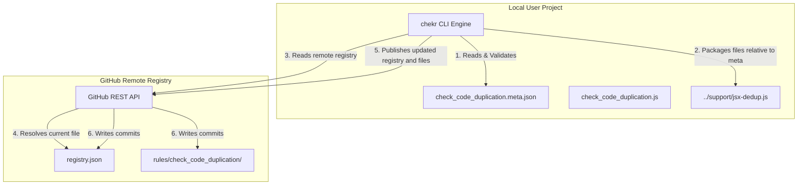

# Requirements

### Overview & Goals
The objective is to establish **Chekr Marketplaces CLI**, a native publishing and distribution system for custom `chekr` rules. Instead of manually copying scripts and maintaining separate repositories, this feature enables:
1. **Rule Publishing (`chekr publish <check-id>`)**: A developer can package a local check script, compile its metadata (including version, tags, recommended languages, author, goals, and multi-file dependencies), and upload it directly to a centralized GitHub-hosted repository using the GitHub REST API.
2. **Rule Installation (`chekr install <check-id>`)**: A developer can download and configure any modular rule from the registry. The CLI resolves dependencies, recursively creates directories, and downloads the required files into their project's configured checks directory (`checksDir`).

This creates a highly flexible, robust, and friction-free ecosystem for distributing sophisticated architectural checks.

---

### Scope

#### In Scope
- **Command `chekr publish <check-id>`**: Resolves local files, validates metadata against a strict JSDoc schema, fetches and updates the remote `registry.json`, and commits/uploads files using Node.js's native `fetch` via the GitHub REST API.
- **Command `chekr install <check-id>`**: Reads the remote registry metadata, recursively downloads files (handling relative subdirectories safely), and places them into the user's project. Detects already-installed checks and prompts the user to override or skip.
- **Local Install Cache (`.chekr/marketplace.lock.json`)**: A lock file tracking every installed check's `id`, `version`, `installedAt` timestamp, and the list of files written to disk. Used for conflict detection, upgrade awareness, and clean uninstall.
- **Co-located JSON Metadata (`<check-id>.meta.json`)**: Local configuration declaring name, goal, description, author, version, hasFixes, tags, recommended languages, and the target source/destination file paths.
- **Flexible Configuration (`chekr.config.js`)**: A new `marketplace` option mapping repository details (`owner/repo`, default `branch`).
- **Strict Validation**: High-confidence runtime schema verification of metadata before publishing to prevent corrupt registry entries.
- **Conflict Resolution UX**: When a check is already installed, the CLI compares versions and prompts the user with clear options: skip, override (force re-download), or upgrade (if a newer version exists in the registry).

#### Out of Scope
- **Web UI Portal**: Postponed. We are entirely focusing on the CLI-driven developer experience first.
- **Centralized Database**: No dynamic backend, API servers, or authentication forms. The remote GitHub repository is the single source of truth, relying on git history and repository permissions.

---

### User Stories
- **As a Rule Author**, I want to run `chekr publish check_code_duplication` in my CLI so that my custom rule and its supporting files are automatically structured, validated, and pushed to the remote GitHub marketplace registry.
- **As a Developer**, I want to run `chekr install check_code_duplication` in my terminal so that the rule and its modular subfiles are cleanly downloaded and immediately ready to run locally.
- **As a Developer**, I want the CLI to warn me if I try to install a check I already have, so I don't accidentally overwrite customized local files without knowing.
- **As a Developer**, I want to run `chekr install check_code_duplication --force` to forcefully re-download and overwrite an existing check without any prompts.
- **As a Team Member**, I want `.chekr/marketplace.lock.json` to be committed to version control so my teammates get the exact same checks when they clone the repo.

---

### Functional Requirements
- **Local Metadata (`<check-id>.meta.json`)**:
  - Resides next to the check script in `.chekr/checks/`.
  - Must define: `id`, `name`, `goal`, `description`, `hasFixes`, `tags`, `recommendedLanguages`, `author`, `version`, and `files` (array of local source to remote relative dest paths).
- **Remote Registry (`registry.json`)**:
  - Central registry file hosted on GitHub containing an array of active marketplace check entries.
- **Publish Command Workflow**:
  - Validates existence of `<check-id>.meta.json` and all local dependency files.
  - Generates the unified entry.
  - Authenticates via a `GITHUB_TOKEN` environment variable.
  - Updates `registry.json` and commits all assets to the configured repository.
- **Install Command Workflow**:
  - Reads remote `registry.json` from the repository's raw content URL.
  - Automatically recreates any nested file structures (e.g., `../support/*`) using recursive directory writes relative to the local `checksDir`.

---

# Technical Design

### Current Implementation
The `chekr` engine currently loads checks dynamically from `config.checksDir` via `packages/cli/src/lib/core/loader.js`.
The CLI parse arguments system (`packages/cli/src/argv/parse-argv.js`) defines standard commands (`run`, `fix`, `list`, `validate`, `init`) but lacks `install` and `publish` keywords.

---

### Key Decisions

#### 1. Co-located JSON Metadata (`<check-id>.meta.json`)
To make checks modular and self-contained, we will define their publishing details in a co-located `<check-id>.meta.json` next to the main check script.
This ensures rule packages can be developed, tested, and distributed as independent units without cluttering the global `chekr.config.js` with metadata.

#### 2. Native zero-dependency REST API Integration
We will leverage Node's standard `fetch` API to push changes to GitHub via the REST API. This avoids bloated dependencies and maintains `chekr` as a fast, lightweight library.
To perform commits without a full Git installation or workspace clone, we will use the GitHub **Create or Update File Contents API** (`PUT /repos/{owner}/{repo}/contents/{path}`).

---

### Registry & Metadata Schema
Using our **professional-typing** principles, we define the TypeScript interfaces for the marketplace metadata (`types/marketplace.d.ts`):

```typescript
export interface MarketplaceFileMapping {
  /** Local path relative to the check script, mapped to remote storage path. */
  src: string;
  /** Final installation path relative to user's configured `checksDir`. */
  dest: string;
}

export interface MarketplaceCheckEntry {
  /** Uniquely identifies the checker (must match check_<name> standard). */
  id: string;
  /** Human-readable short title. */
  name: string;
  /** A one-line summary of what the rule aims to achieve. */
  goal: string;
  /** Detailed description of the full checking logic and algorithms. */
  description: string;
  /** Indicates whether the check has a corresponding auto-fixer script. */
  hasFixes: boolean;
  /** Categorization tags for searching. */
  tags: string[];
  /** Recommended programming languages target (e.g. ["jsx", "tsx", "js", "ts"]). */
  recommendedLanguages: string[];
  /** Script author credentials or name. */
  author: string;
  /** Semantic version string (e.g., "1.0.0"). */
  version: string;
  /** Mapped files required for this check to function properly. */
  files: MarketplaceFileMapping[];
}

export type MarketplaceRegistry = MarketplaceCheckEntry[];
```

Example `<check-id>.meta.json` (e.g., `.chekr/checks/check_code_duplication.meta.json`):
```json
{
  "id": "check_code_duplication",
  "name": "Code Duplication Detector",
  "goal": "Detects fuzzy similarity across React, JSX, and TSX files using sliding-window LCS.",
  "description": "Performs complex matrix matching to flag duplicate interfaces, structural components, and repetitive logic blocks to maximize reuse.",
  "hasFixes": false,
  "tags": ["duplication", "jsx", "maintenance"],
  "recommendedLanguages": ["jsx", "tsx", "javascript", "typescript"],
  "author": "Chekr Core Team",
  "version": "1.0.0",
  "files": [
    {
      "src": "check_code_duplication.js",
      "dest": "check_code_duplication.js"
    },
    {
      "src": "../support/jsx-dedup.js",
      "dest": "../support/jsx-dedup.js"
    },
    {
      "src": "../support/react-loc-counter.js",
      "dest": "../support/react-loc-counter.js"
    }
  ]
}
```

---

### Configuration Block (`chekr.config.js`)
We will add a new `marketplace` option to `ChekrConfig` to set remote registry references:
```javascript
export default {
  checksDir: "./.chekr/checks",
  marketplace: {
    repository: "owner/chekr-marketplace",
    branch: "main"
  }
};
```

---

### Architecture Diagram



---

### CLI Implementation Logic

#### 1. Command Registration
Add `"publish"` and `"install"` to `parse-argv.js`:
```javascript
const COMMANDS = new Set(["run", "fix", "list", "validate", "init", "install", "publish"]);
```

#### 2. Publish Command (`packages/cli/src/commands/publish.js`)
- Load `chekr.config.js` to extract `marketplace` repository details.
- Locate the target `<check-id>.meta.json` inside `checksDir`.
- Parse and strictly validate metadata against `MarketplaceCheckEntry`.
- Verify all declared dependencies in `files` exist locally.
- Fetch current remote `registry.json` via GitHub API.
- Merge the new entry (or update if version changes).
- For each file in `files`:
  - Upload the file to `rules/<check-id>/<dest>` relative paths in the remote repository.
- Upload the newly serialized `registry.json` back to the repository.
- Output success confirmation.

#### 3. Install Command (`packages/cli/src/commands/install.js`)
- Load `chekr.config.js` to find the local target `checksDir`.
- Fetch remote `registry.json` using the configured repository endpoint.
- Locate the requested check metadata.
- **Read `.chekr/marketplace.lock.json`** to check if the check is already installed:
  - If same version → print `Already installed (v1.0.0). Use --force to reinstall.` and exit.
  - If older version installed → print `Upgrade available: v1.0.0 → v1.1.0. Proceed? [y/N]`.
  - If `--force` flag is passed → skip prompts and overwrite all files.
- For each mapped file:
  - Generate the destination directory tree recursively.
  - Download raw content from the corresponding repository file.
  - Write file cleanly to local disk (atomic: write to `.tmp` then rename).
- **Update `.chekr/marketplace.lock.json`** with the new entry (id, version, installedAt, files list).
- Output completion and summary details.

#### 4. Lock File Schema (`.chekr/marketplace.lock.json`)
```json
{
  "version": 1,
  "installed": [
    {
      "id": "check_code_duplication",
      "version": "1.0.0",
      "installedAt": "2024-01-15T10:30:00.000Z",
      "repository": "owner/chekr-marketplace",
      "files": [
        ".chekr/checks/check_code_duplication.js",
        ".chekr/support/jsx-dedup.js"
      ]
    }
  ]
}
```
This file should be committed to version control so teams share the same installed checks.

---

### Risks & Mitigations

 Risk | Mitigation |
------|------------|
 **Malicious Scripts**: Users downloading harmful third-party checker scripts. | **Secure Repository Controls**: Only vetted, admin-reviewed rules can be added to the registry repository through standard PR validation and protected branches. |
 **Relative Path Drift**: Moving support helper scripts breaking local imports. | **Explicit Destination Maps**: Files are placed exactly where defined by `dest` relative to `checksDir`, keeping relative file paths perfectly aligned. |
 **Duplicate Installs**: User runs `chekr install` twice on the same check. | **Lock File Check**: Before downloading, the CLI reads `marketplace.lock.json` and compares versions. Same version → skip with message. Newer version → prompt upgrade. `--force` flag bypasses all prompts. |
 **Partial Install Failure**: Network drops mid-download leaving corrupt files. | **Atomic Writes**: Each file is written to a `.tmp` sibling first, then renamed. On failure, all `.tmp` files are cleaned up and the lock file is not updated. |
 **Token Safety**: Leaking personal GitHub access tokens during publish commands. | **Environment Variables**: The publishing workflow strictly relies on `process.env.GITHUB_TOKEN` from the shell, preventing secrets from being hardcoded. |

---

# Testing

### Verification Scenarios
- **Metadata Validation Suite**: Tests to verify metadata parsing catches missing tags, invalid versions, or empty files arrays.
- **Mock Publish Commands**: Integration tests mocking GitHub REST API requests to ensure registry additions and multiple file commits are safely composed.
- **Mock Install Commands**: Tests simulating a download from raw GitHub URLs, validating recursive directory creations and atomic write integrity.
- **Lock File Conflict Tests**: Tests verifying that re-installing the same version prints a skip message, that an older version triggers an upgrade prompt, and that `--force` bypasses all checks.
- **Atomic Write Tests**: Tests simulating a mid-download failure to confirm `.tmp` files are cleaned up and the lock file remains unchanged.

---

# Delivery Steps

### ✓ Step 1: Define Marketplace Registry Schemas and Types
Define the core metadata specifications and local config extensions.
- Create `types/marketplace.d.ts` detailing metadata mapping contracts.
- Update `types/chekr.config.d.ts` and `types/primitives.d.ts` to support the new `marketplace` config field.
- Create runtime JSON validators in `packages/cli/src/lib/core/validator.js` to verify meta shapes.

### ✓ Step 2: Implement and Validate 'publish' Command
Add rule uploading capabilities to the remote repository.
- Wire `"publish"` into `parse-argv.js` and `packages/cli/src/index.js`.
- Write `packages/cli/src/commands/publish.js` to parse `<check-id>.meta.json`, validate paths, update remote registry, and perform raw REST API commits.
- Implement comprehensive unit tests mocking GitHub endpoints.

### ✓ Step 3: Implement and Validate 'install' Command with Lock File
Add rule fetching capabilities to the local project with professional conflict detection and caching.
- Wire `"install"` into `parse-argv.js` and `packages/cli/src/index.js` (support `--force` flag).
- Write `packages/cli/src/commands/install.js` to:
  - Read and parse `.chekr/marketplace.lock.json` before any download.
  - Compare installed version vs. remote version and handle skip/upgrade/force flows.
  - Perform atomic file writes (`.tmp` → rename) for each downloaded file.
  - Update the lock file only after all files are successfully written.
- Write `packages/cli/src/lib/marketplace/lock.js` as a dedicated lock file manager (read, write, find entry, upsert entry).
- Implement integration tests validating file creations, lock file updates, conflict detection, and atomic write rollback on failure.